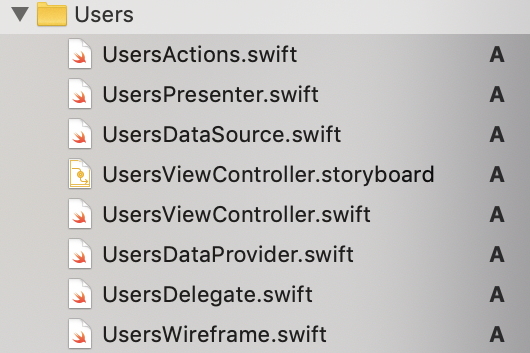

# Meranti template for Xcode

Meranti MVP

Meranti is the name given to the project architecture featured in the [In Tune](https://github.com/ronanociosoig/inTune) app. 

## Core Features: 

- AppController: The root controller of the app. 
- Coordinator: [coordinator pattern](http://khanlou.com/2015/01/the-coordinator/) The class responsible for all that happens on the screen.
- DataProvider: The data abstraction layer. 
- Actions: A calss to encapsulate all the events that require external calls from a screen.
- AppData: A global shared in-memory data reference.

## New Screen

When adding a new screen, it is best to create a folder and then select the appropriate template: View, TableView or CollectionView.

The TableView template will generate all the files necessary for displaying the table view in the project and connected together. 

For example: UsersTableView

The Wireframe always has 2 static calls. The first loads the storyboard, and returns the viewController instance. The second connects the presenter with the view Controller and instantiates the delegate and data source, and injects the data provider and actions class. 

## Installing

To install the template, download the project to the desktop and run the install script. It will copy over the template into your user file templates folder, and replace an exising version. 